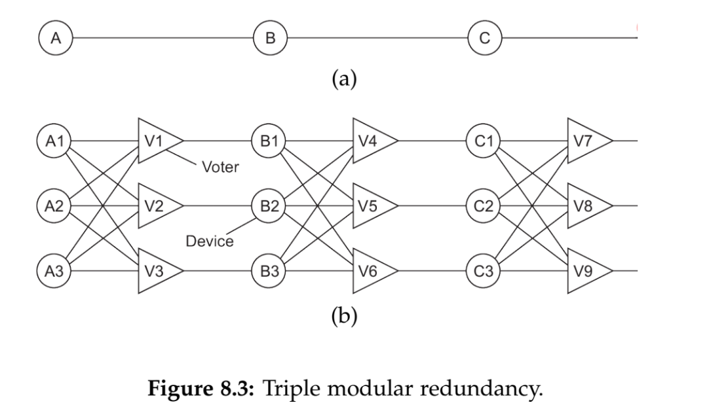

1. **三倍模块冗余（Triple Modular Redundancy，TMR）的模型能够处理拜占庭故障吗？为什么？**
    不可以，当考虑k=1时，例子如下：

    
    TMR的基本原理是使用三个相同的模块，并通过比较它们的输出来达到容错的目的。如果一个模块由于硬件故障产生了错误的输出，其他两个模块可以通过多数投票选择正确的输出。这对于应对单一故障很有效，因为三个模块中至少有两个是正常的。

    然而，在面对拜占庭故障时，情况变得更为复杂。拜占庭节点可能不仅仅提供错误的输出，还可能故意与其他节点协同合谋，提供一致的错误输出，以欺骗TMR系统。拜占庭节点可能还会试图破坏多数投票的机制，使得系统无法正确识别正确的输出。

    即如果时3k个节点的话，并不能处理拜占庭故障，因为无法利用少数服从多数的原则判别哪个是正确的信息

2. **在可靠的多播中，通信层是否总是需要保留消息的副本以便重新传输？**
    通信层通常需要采取一些机制来确保消息的可靠传递，其中包括重新传输、抑制反馈等。但并不总是需要保留消息的完整副本来进行重新传输。具体的实现方式取决于使用的协议和系统设计。

3. **在两阶段提交协议中，为什么即使参与方选举了新的协调者，阻塞永远无法完全消除？**
    在两阶段提交协议中，即使参与方选举了新的协调者，阻塞无法完全消除的主要原因是存在网络分区（Network Partition）或其他类似的故障情况。

    两阶段提交协议包含下面两个阶段：

    1. **准备阶段（Prepare Phase）：** 在该阶段，事务参与方询问其他参与方是否可以提交事务，并且它们会向协调者发送准备就绪（prepared）或者不准备（not prepared）的消息。

    2. **提交阶段（Commit Phase）：** 如果所有的参与方都准备就绪，协调者将发送一个提交（commit）消息；否则，如果任何一个参与方不准备好，协调者将发送一个中止（abort）消息。

    在正常情况下，这两个阶段的执行能够保证事务的一致性。然而，如果协调者在提交阶段发送了提交消息后发生故障，导致部分参与方无法收到提交消息，就可能导致事务的不一致性。

    即使在发生这种情况后，参与方选举了新的协调者，由于网络分区等问题，新协调者可能无法联系到之前的协调者或部分参与方，从而无法得知事务的最终状态。这种不确定性导致了阻塞，因为新协调者无法确定是否可以安全地提交或中止事务。

4. **无状态服务器是否需要进行检查点？**
    无状态服务器通常不需要进行检查点。无状态服务器是指服务器在处理请求时不依赖于先前的请求状态，每个请求都可以独立处理，而不需要记住先前的信息。
