<h1><center>中山大学计算机学院</center></h1>
<h1><center>分布式系统</center></h1>
<h1><center>本科生实验报告</center></h1>
<center>（2023学年秋季学期）</center>

<center> 课程名称：Distributed System</center>
<style>
.center 
{
    width: auto;
    display: table;
    margin-left: auto;
    margin-right: auto;
}
</style>

<div class="center">

|姓名|教学班级|学号|日期|
| :---: |:----: |:---: | :---: |
|张礼贤  |计科二班  |21307185 |2023.12.14 |

</div>

<h1><center>分布式文件系统设计</center></h1>

### 题目要求
* **基本要求：**
    1. 编程语言不限，选择自己熟悉的语言，但是推荐用Python或者Java语言实现；
    2. 文件系统中不同节点之间的通信方式采用RPC模式，可选择Python版本的RPC、gRPC等；
    3. 文件系统具备基本的文件操作模型包括：创建、删除、访问等功能；
    4. 作为文件系统的客户端要求具有缓存功能即文件信息首先在本地存储搜索，作为缓存的介质可以是内存也可以是磁盘文件；
    5. 为了保证数据的可用性和文件系统性能，数据需要创建多个副本，且在正常情况下，多个副本不在同一物理机器，多个副本之间能够保持一致性（可选择最终一致性即延迟一致性也可以选择瞬时一致性即同时写）；
    6. 支持多用户即多个客户端，文件可以并行读写（即包含文件锁）；
    7. 对于上述基本功能，可以在本地测试，利用多个进程模拟不同的节点，需要有相应的测试命令或者测试用例，并有截屏或者video支持；
    8. 提交源码和报告，压缩后命名方式为：学号_姓名_班级
    9. 实验报告长度不超过20页；
* **加分项：**
    1. 加入其它高级功能如缓存更新算法；
    2. Paxos共识方法或者主副本选择算法等；
    3. 访问权限控制；
    4. 其他高级功能；

---

### 流程图
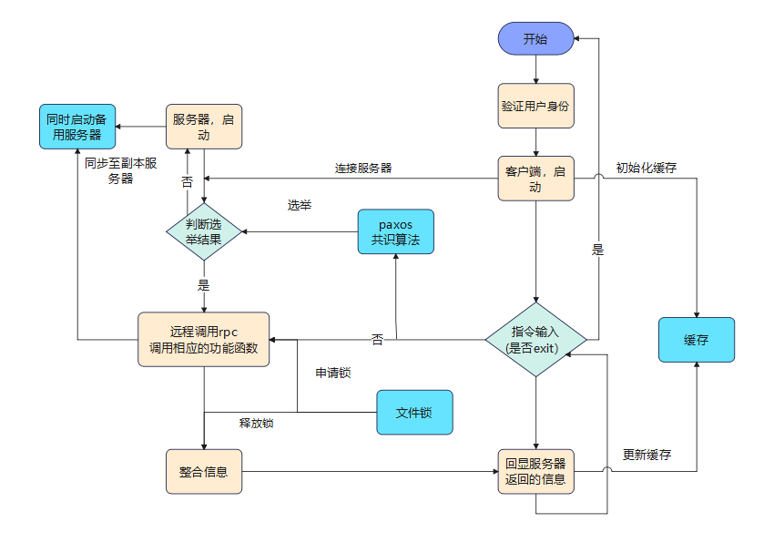

---

### 解决思路
#### 基础任务
1. **通信方式采用RPC模式：**
   - **关键技术：** RPC (Remote Procedure Call)
   - **解决思路：** 使用Python中的RPC框架，例如XML-RPC、JSON-RPC，或者更先进的gRPC。这允许在不同节点之间远程调用函数，实现文件系统节点之间的通信。

2. **基本文件操作模型：**
   - **关键技术：** 文件系统操作原语，如create、delete、open、read、write等。
   - **解决思路：** 实现基本文件系统调用，确保对文件的创建、删除和访问等操作。可以借助分布式文件系统的设计理念来构建。

3. **具备缓存功能：**
   - **关键技术：** 缓存策略、本地存储。
   - **解决思路：** 实现一个本地缓存系统，文件信息首先在本地存储，并根据一定的缓存策略进行更新和失效。缓存可以存在于内存中，也可以定期写入磁盘文件。这里选取了存在于磁盘文件中，用磁盘文件模拟缓存，并通过写回进行缓存更新

4. **数据多副本、一致性：**
   - **关键技术：** 复制、一致性算法。
   - **解决思路：** 在分布式系统中，通过复制数据到多个节点来提高数据可用性。使用一致性算法，如Paxos、Raft，以保持多个副本之间的一致性。确保副本不在同一物理机器上，以提高容错性。基础任务中通过构建服务器类，创建服务器列表，通过多个服务器保证可靠性，当用户登录服务器时会使用服务器列表中的一个服务器，在该服务器对应的文件夹下进行对文件的操作。并且将该操作同步到剩余的服务器列表的服务器中，实现复制、一致性。

5. **支持多用户、并行读写：**
   - **关键技术：** 文件锁、并发控制。
   - **解决思路：** 实现文件锁机制，允许多个用户并行读写文件。使用分布式锁或类似机制来协调多个客户端对同一文件的并发操作，以避免数据不一致和冲突。其中写利用文件锁进行加锁，即用户写文件的时候向系统申请一个文件锁，若有则给予并且加锁，期间不允许其他的用户对该文件进行操作；若无，则等待，直至锁被释放。（可以设置超时时间，防止盲目等待）

---

#### 提升任务（加分项）

1. **缓存更新算法：**
    - **关键技术：** LRU算法实现
    - **解决思路：** 将缓存机制改为在内存中实现，通过设置文件路径名与文件内容一一对应的字典，来模拟缓存的实现。如果读取缓存中的文件，则将该文件移至最新的条目，方便快速检索。

2. **文件高级操作：**
    - **关键技术：** 文件夹创建、级联删除；文件的上传与下载
    - **解决思路：** 文件夹创建利用makedir函数进行，级联删除利用rmtree进行；上传与下载需要指定文件的路径，需要进行判断和整合

3. **访问权限控制：**
    - **关键技术：** 用户的识别与权限的给予
    - **解决思路：** 通过服务器内置字典实现用户名字与密码的存储，并且一一对应其访问权限。

4. **Paxos共识算法的简易实现：**
    - **关键技术：**

        1. Prepare阶段： 在这个阶段，Paxos算法中的多数派服务器会生成一个新的提议并返回给客户端。在这个实现中，我们只需要确保prepare方法在调用之前生成一个更大的proposal_id。
        2. Accept阶段： 在这个阶段，服务器会接受一个提议，并返回一个值。这个实现中，我们只需要确保accept方法在调用之前接受一个不小于当前proposal_id的提议，并将它和值存储下来。
        3. Decide阶段： 在这个阶段，Paxos算法会决定一个值。在这个实现中，我们只需要在decide方法中打印出决定的值。

    - **解决思路：**

        1. Proposer： 在Paxos算法中，Proposer会发送一个提议，然后进入Prepare阶段。在这个实现中，我们可以使用run_paxos方法来模拟Proposer的行为。
        2. Acceptor： 在Paxos算法中，Acceptor会接受一个提议，并返回一个值。在这个实现中，我们可以使用accept方法来模拟Acceptor的行为。
        3. Learner： 在Paxos算法中，Learner会从已经达成共识的服务器中学习到一个值。在这个实现中，我们可以在decide方法中打印出已经达成的共识的值。
---

### 实现细节
#### 1. 通信方式采用RPC模式：

**Server端：**
- 使用Python的**SimpleXMLRPCServer**搭建RPC服务器。
- 实例化**DistributedFileSystem**类，并将其实例注册到RPC服务器。
- 使用 **rpc_server.serve_forever()** 持续监听RPC请求。
    ```python
    # 创建分布式文件系统对象
    server_id = 1  # 当前服务器ID
    distributed_server = DistributedServer(server_id)

    # 创建RPC服务器
    rpc_server = SimpleXMLRPCServer(('localhost', 8000), allow_none=True)
    rpc_server.register_instance(distributed_server)

    print("RPC服务器已启动，等待客户端连接...")

    # 启动服务器
    rpc_server.serve_forever()
    ```

**Client端：**
- 利用**xmlrpc.client.ServerProxy**连接到RPC服务器。
- 根据用户输入调用**rpc_server**实例提供的方法进行远程过程调用。

    ```py
    rpc_server = ServerProxy('http://localhost:8000', allow_none=True)
    ```

#### 2. 基本文件操作模型：

**Server端：**
- 在**DistributedFileSystem**类中实现基本文件操作（**create_file**、**delete_file**、**read_file**、**write_file**、**list_files**）。
- 以**write_file**为例，其余的函数略：
    ```py
    def write_file(self, file_name, data):
        file_path = os.path.join(self.server_files_directory, file_name)
        
        if os.path.exists(file_path):
            self.file_directory[file_name] = data.encode()

            # 更新server_files目录下的文件
            with open(file_path, 'wb') as file:
                file.write(data.encode())

            return f"文件 {file_name} 写入成功"
        else:
            return f"文件 {file_name} 不存在"
    ```

- 其中list_files的结果为：

    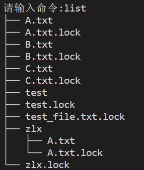

    采用了树状结构，使得结果更为清晰


**Client端：**
- 从用户输入中获取客户端命令（**create**、**delete**、**read**、**write**、**list**）。
- 根据用户输入调用相应的RPC方法。
- 以**write**为例
    ```py
    if command == "write":
        data = input("请输入要写入的数据: ")
        # write_back(file_name, data)
        # 异步更新服务器
        rpc_server.write_file(file_name, data)
    ```


#### 3. 具备缓存功能：

**Server端：**
- 服务器维护一个内存缓存（**file_directory**）用于文件内容。
- 文件信息也存储在服务器端的文件中（**server_files**目录）。
    ```py
    script_directory = os.path.dirname(os.path.abspath(__file__))
    self.server_files_directory = os.path.join(script_directory, 'server_files')
    os.makedirs(self.server_files_directory, exist_ok=True)
    self.file_directory = {}  # 服务器端内存缓存
    ```

**Client端：**
- 使用**CACHE_DIR**进行本地缓存。
    ```py
    CACHE_DIR = 'client_cache'
    os.makedirs(CACHE_DIR, exist_ok=True)
    ```
- 在进行RPC调用之前检查缓存，如果文件存在于缓存中，则从缓存中读取信息。
- 在每次RPC调用后更新缓存文件(利用写回算法)。
    ```py
    def write_back(file_name, data):

    if(rpc_server.is_lock_in_use()):
        print("锁正在被占用……，请稍等")

    cache_file_path = os.path.join(CACHE_DIR, f'{file_name}_cache.json')

    # 更新本地缓存
    with open(cache_file_path, 'w') as cache_file:
        json.dump(data, cache_file, indent=2)

    print(f"使用写回算法更新本地缓存 {file_name}")

    ```

#### 4. 数据多副本、一致性：

**Server端：**
- 确定当前的服务器，并创建相应的文件夹：
    ```py
    self.server_files_directory = os.path.join(script_directory, f'server_{server_id}_files')
    os.makedirs(self.server_files_directory, exist_ok=True)
    ```
- 确定剩余的服务器列表，可以根据需要生成相应的数量：
    ```py
    self.auxiliary_servers = [os.path.join(script_directory, f'server_{i}_files') for i in range(1, 3) if i != server_id]
    for aux_server in self.auxiliary_servers:
        os.makedirs(aux_server, exist_ok=True)
    ```

- 以写操作为例子，当写入当前服务器之后，需要将该操作同步到剩余的辅助服务器，实现一致性：
    ```py
    for auxiliary_server in self.auxiliary_servers:
        threading.Thread(target=self.copy_file, args=(file_name, file_path, auxiliary_server)).start()
    ```

- 剩余的基本操作create、delete等都类似，需要将当前的文件操作同步至所有的服务器


#### 5. 支持多用户、并行读写：

**Server端：**
- 服务器使用文件锁（**file_lock**）来在文件操作期间提供互斥。
- 获取锁与释放锁：

- 对文件的进行基本操作时需要检查文件锁的可用性，这里以write_file为例子：
    ```py
    def write_file(self, file_name, data):
        lock_file = self.acquire_lock(file_name)    # 检查锁的可用性
        if not lock_file:
            return "无法获取文件锁，写操作失败"
        try:
            #……写文件(省略)
            self.release_lock(lock_file)    # 写操作成功则释放锁
            # 在辅助服务器上写入文件
            for auxiliary_server in self.auxiliary_servers:
                threading.Thread(target=self.copy_file, args=(file_name, file_path, auxiliary_server)).start()
        except:
            self.release_lock(lock_file)    # 写操作失败也释放锁，防止死锁
    ```


#### 6. 缓存更新算法的实现：

- **LRU类的设计：**
    下面的LRU类的设计将文件和文件信息一一对应，并且可以设置最大容量，获取当前的文件顺序，将最新访问的文件放置字典的末尾
    ```py
    # 简略版
    class LRUCache:
    def __init__(self, capacity=5):
        self.cache = OrderedDict()
        self.capacity = capacity

    def get_cache_order(self):
        # 返回当前缓存中的文件顺序

    def get(self, key):
        # 将该项移到字典的末尾，表示最近使用


    def put(self, key, value):
        # 移除字典的第一项，即最久未使用的项
        # 将新项加入字典末尾

    def pop(self, key):
        return self.cache.pop(key, None)
    ```


- **缓存更新算法的实现：**
    当将文件读入到缓存之后，如果再次对文件进行了写操作，则会导致再次读入的数据不是正确的结果，因此需要设计一种机制进行判别。这里使用了时间戳比较法，即比较服务器端文件的最新更改时间和存入缓存中的文件时间戳，如果一样则无需更改，如果不相同则需要远程读取文件信息，并且更新缓存
    ```py
    # client 中 read_file 函数切片
    # 获取文件的最后修改时间
    cached_mtime = file_info.get('mtime', 0)
    # 获取服务器上文件的最后修改时间
    server_mtime = rpc_server.get_mtime(file_name)

    if cached_mtime == server_mtime:
        print(f"从缓存中读取文件 {file_name} 的信息")
        return file_info
    else:
        print(f"文件 {file_name} 已经被修改，更新缓存")
    ```

---

#### 7.文件操作的进阶
- **实现文件夹的创建、写入、级联删除：**
    * 如果只能创建文件会使得文件系统过于单调，因此添加了文件夹的适配性能，可以通过在client端输入create_folder创建文件夹（默认在服务器根目录下创建）
    * 对于写入，与原先的write实现大致相同，需要指定文件路径。比如服务器目录下有一文件夹test，里面有文件A则写入的时候需要指定test\A
    * 对于删除，使用 shutil.rmtree： shutil.rmtree 是Python标准库中的一个函数，用于递归删除文件夹及其内容。这个函数会递归地删除文件夹中的所有文件和子文件夹，而不需要手动遍历和删除。
        ```py
        if os.path.isfile(file_path):
            # 如果是文件，直接删除
            os.remove(file_path)
        elif os.path.isdir(file_path):
            # 如果是文件夹，使用 shutil.rmtree 递归删除
            shutil.rmtree(file_path)
        ```


- **实现文件的下载、上传：**
    * **下载：**
        download函数可以从服务器的文件夹下获取文件，将文件传输给client本地，放在本地文件夹下
        ```py
        def download_file(self, file_name):
            file_path = os.path.join(self.server_files_directory, file_name)

            if os.path.exists(file_path):
                with open(file_path, 'rb') as file:
                    file_data = base64.b64encode(file.read()).decode()
                    return {'file_data': file_data, 'file_name': file_name}
            else:
                return f"文件 {file_name} 不存在"
        ```

    * **上传：**
        upload函数可以指定磁盘中任意位置的文件上传至服务器，并且可以指定上传到服务器的指定文件夹中
        ```py
        file_name = os.path.join(folder, file_name)
        server_file_path = os.path.join(self.server_files_directory, file_name)
        with open(server_file_path, 'wb') as file:
            file.write(base64.b64decode(file_data))

        # 将文件同步到所有辅助服务器
        for auxiliary_server in self.auxiliary_servers:
            threading.Thread(target=self.copy_file, args=(file_name, server_file_path, auxiliary_server)).start()
        ```


#### 8.访问权限的控制
- **用户登录：**
    这里实现一个相对简单的登录方式，利用服务器内置字典的方法进行验证，client登录服务器后需要输入用户名和密码，服务器进行匹配验证，并且对于给定的权限进行控制
    ```py
    # users
    self.users = {
        'user1': {'password': 'password1', 'permissions': ['read', 'write', 'delete']},
        'user2': {'password': 'password2', 'permissions': ['read']}
        # 可以根据需要添加更多用户和权限
    }
    # 身份验证
    user_permissions = self.authenticate_user(username, password)
    if not user_permissions:
        return "身份验证失败，无法读取文件"

    # 检查读取权限
    if not self.check_permissions(username, 'read'):
        return "无权读取文件"
    ```

#### 9. Paxos共识算法的简易实现
详情请见paxos.py文件，对代码的分析如下：

1. **Paxos 类：**
   - Paxos 类表示 Paxos 共识算法的单个实例。
   - prepare 方法由提议者用于从接受者请求承诺。如果提案 ID 大于当前提案 ID，则接受者承诺不接受更低 ID 的任何提案。
   - accept 方法由提议者用于向接受者发送接受的提案。
   - decide 方法在达成共识时被调用，打印已决定的值。

2. **PaxosServer 类：**
   - PaxosServer 类表示运行 Paxos 算法的服务器实例。
   - run_paxos 方法尝试运行 Paxos 算法的一个阶段，首先调用 prepare 方法，然后根据返回结果调用 accept 方法。
   - generate_id 方法用于生成一个新的提案 ID，确保每个提案 ID 都是唯一的，且递增（如果不是递增的则会否定掉决议）。


### 运行情况
1. **测试基本文件操作：**
    详情测试文件请见test_code中的test_operate.py，实验结果如下所示：

    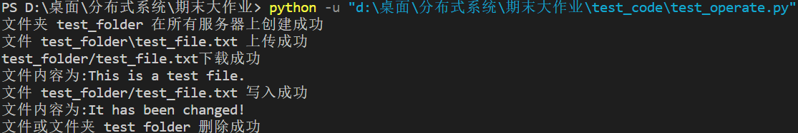

    可见得到了正确的结果

2. **测试缓存的使用：**
    * 为了测试缓存的使用，通过运行服务器，并且另开一个窗口运行client代码，创建文件test.txt，写入信息This is some data

        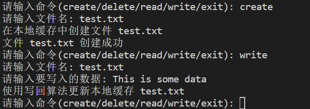
    * 一开始，创建文件的同时创建了文件的缓存（即利用磁盘文件作为缓存的介质）
    * 当写入文件的时候，此时缓存与文件不一致，因此调用写回的算法更新缓存
    * 当读取文件的时候，将从client_cache文件夹中读取相应文件的缓存，不用从服务器端读取

        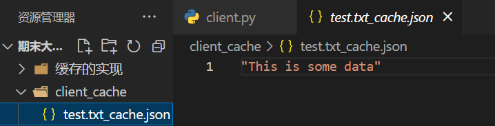
    
3. **测试副本和一致性：**
    * 首先启动服务器，用client代码连接服务器，创建测试文件test.txt

        

        可以看到创建test.txt文件成功，在两个服务器文件夹下都可见

    * 调用write对文件进行写操作：

        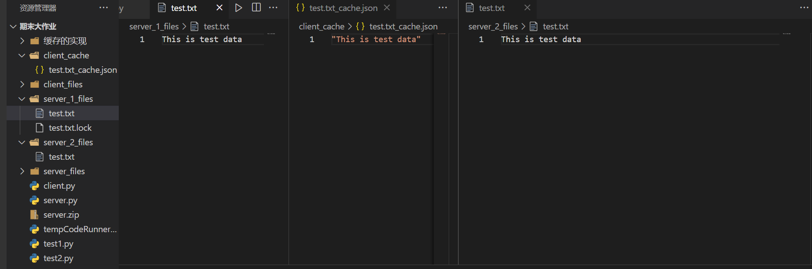

        此时对于两个服务器下的文件夹下都实现了副本的一致性更新，并且生成了对应的本地缓存，因为更改了文件，触发了写回的效果
    
    * 调用read对文件进行读操作：

        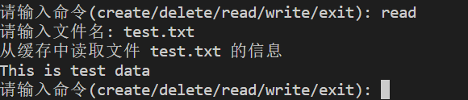

        可见通过读操作从本地缓存中读取了相应的信息并正确显示

    * 调用delete删除文件：

        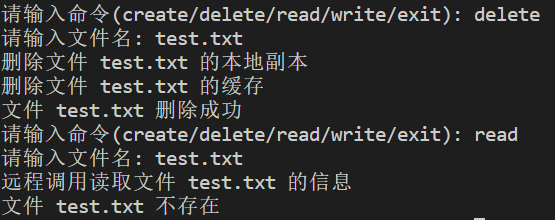

        可以看到通过调用delete函数将test.txt文件删除并且同时删除了本地的缓存，再次读取文件发现不能从本地进行读取，而只能从远程进行rpc调用，发现文件并不存在，说明文件已经被删除

4. **测试文件的并行读写：**
    * **文件的并行读：**
        假定有一个文件test，里面存在可读取的内容，为了测试并行读取，在服务器类的read_file函数中加入了时间戳函数，即每当有一个进程进入到服务器进行读取即显示出时间戳，为了体现准确度，选用了1000个进程进行测试。

        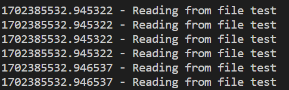

        测试结果如上图所示，运行测试文件test_read显示进程读取文件的时间戳，发现相差无几，约为纳秒级别的误差，在误差范围内，说明实现了并行读取

    * **文件的并发写：**

        同样有一个文件test，选用10个进程同时运行执行读写操作，通过输出结果查看文件的读写是否存在不一致的情况，测试代码进程部分如下：
        ```py
        def run_test(client_id, file_system):
        file_name = 'test'
        
        # 模拟并发写操作
        data_to_write = f"Data written by Client {client_id}"
        file_system.write_file(file_name, data_to_write)
        print(f"Client {client_id} wrote to file: {data_to_write}")

        # 模拟并发读操作
        read_data = file_system.read_file(file_name)
        print(f"Client {client_id} read from file: {read_data}")
        ```

        运行测试文件test_write得到结果如下：
        
        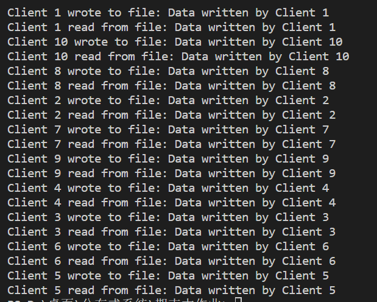

        通过上面的结果示意图可知，10个进程并行运行，由于文件锁的存在，无法同时写文件，因此存在一定的顺序（随机，并未指定）。每一个进程模拟先写后读的操作，如果出现混乱的现象则会导致写入和读出的结果不一致，但是结果显示都是正确的结果，说明实现了文件的并行读写


5. **缓存更新算法的实现：**
    在测试前建立三个测试文件`A.txt` `B.txt` `C.txt`，初始的数据为`This is A data` `This is B data` `This is C data`按照如下图片的指令顺序进行测试，得到如下结果：

    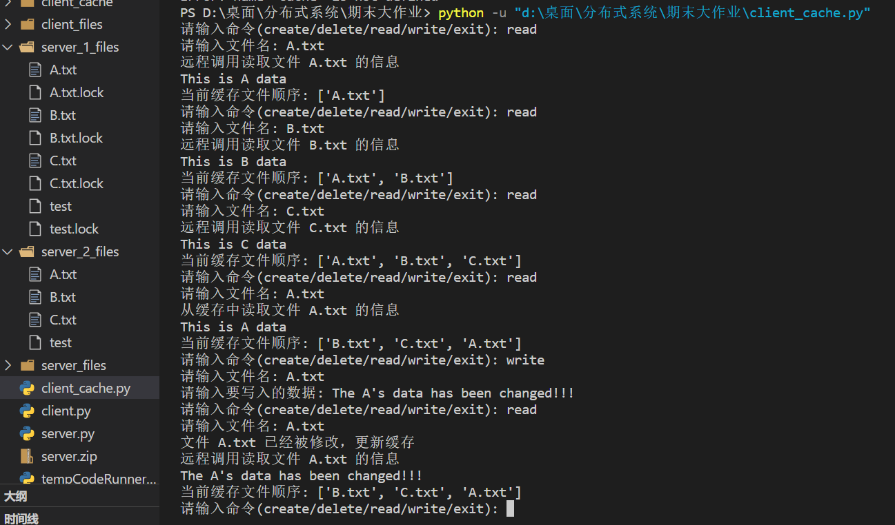

    * 由此可见，通过实现LRU缓存更新算法，实现了缓存的更新和读取
    * 并且可以获取服务器端写入文件的时间戳和LRU中保存的时间戳，通过比较如果相同则无需更新缓存，如果不同则说明文件在进入缓存之后被修改过，因此需要更新缓存。
    * 在每次读取文件信息后都显示了当前的LRU文件组织顺序，被读取的文件会被提升到top端，体现了LRU的性质


6. **访问权限控制：**
    对访问权限进行测试，其结果如下所示：

    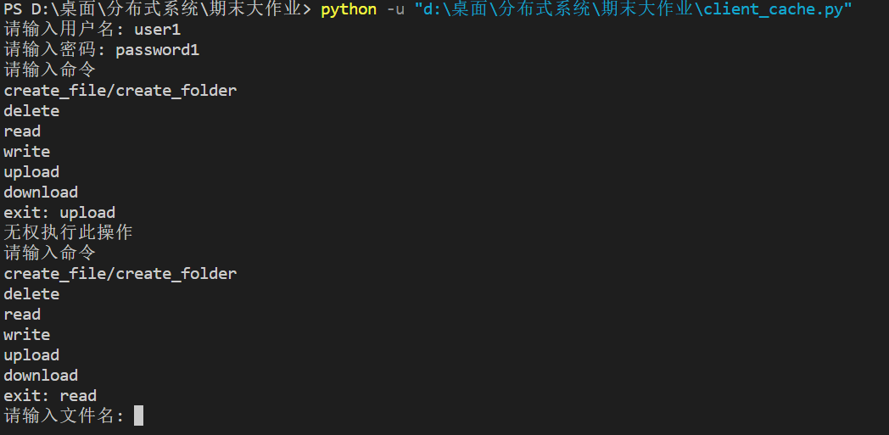

    可见很好地实现了权限控制


7. **Paxos实现：**
    通过左边在client端输入测试代码，得到右边服务器的显示结果，在终端上打印出了paxos共识算法通过的操作

    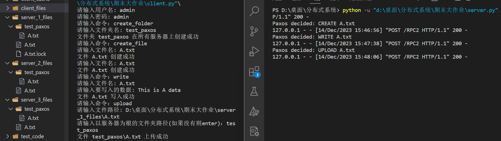

    最后删除文件夹，在终端显示出来：
    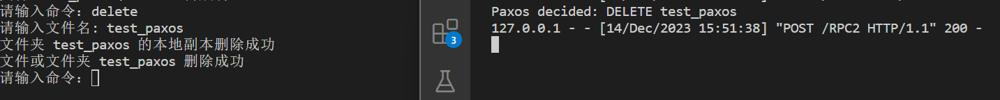


---

### 遇到的问题

1. 缓存的更新问题
    * 在实现缓存更新算法的时候，遇到了当其他进程更改文件后无法正确读取文件的情况（因为默认先从缓存读取，而他人的更改并没有同步到自己的缓存）
    * 后来将文件最后一次修改的时间存入缓存，每次读取的时候进行对比，如果不一致则远程调用服务器文件内容，更新缓存
2. 文件操作进阶时同名文件的问题
    * 在文件名前加上以服务器文件夹为根目录的相对路径即可

3. Paxos算法出现提议不通过的问题
    * 在测试Paxos共识算法的时候，出现了某一些决议不通过的情况，经过问题的排查发现是生成的任务id并不是递增的导致的，这会导致在决议中不通过。
    * 因此更改了算法的实现，保证生成随机id的时候随着任务申请数量的递增而递增


---


### 总结

通过本次分布式文件系统的设计与实现，我们深入探讨了多个关键技术和解决思路，从基础任务到提升任务，逐步完善了系统的功能和性能。以下是我们在这个大作业中所学到的关键点和总结：

1. **通信方式采用RPC模式：**
   - 选择适当的RPC框架是确保分布式系统节点之间有效通信的基础。在本次实现中，我们介绍了Python中的XML-RPC、JSON-RPC以及更先进的gRPC。

2. **基本文件操作模型：**
   - 文件系统的基本操作是构建分布式文件系统的关键。我们通过实现文件系统调用，确保了对文件的创建、删除和访问等基本操作的有效支持，借鉴了分布式文件系统的设计理念。

3. **具备缓存功能：**
   - 引入缓存功能可以显著提高系统性能。我们选择了磁盘文件模拟缓存的方式，通过写回策略实现了缓存的更新，提高了文件的访问速度。

4. **数据多副本、一致性：**
   - 通过复制数据到多个节点和应用一致性算法（如Paxos、Raft），我们确保了数据的可用性和一致性。这为系统的可靠性提供了基础。

5. **支持多用户、并行读写：**
   - 文件锁机制和并发控制是保障多用户并行读写的关键。通过实现文件锁机制，我们有效协调了多个客户端对同一文件的并发操作，避免了数据不一致和冲突。

6. **提升任务（加分项）：**
   - 引入高级操作，如LRU算法实现缓存更新、文件夹创建与级联删除、文件的上传与下载、访问权限控制以及Paxos共识算法的简易实现，进一步提升了系统的功能和灵活性。

通过这个大作业，我不仅深入理解了分布式系统的核心概念和技术，还学到了如何通过合理的设计和实现解决实际问题。分布式文件系统的构建过程中，我面对了通信、一致性、并发等多个方面的挑战，通过不断优化解决方案，最终建立了一个具有较好性能和可扩展性的分布式文件系统。这次经历使我更加熟悉了分布式系统的设计原则和实践方法，为今后的系统设计和开发奠定了坚实的基础。


