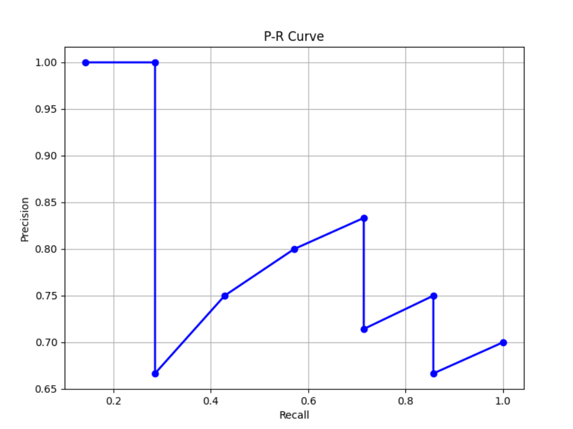

<h1><center>中山大学计算机学院</center></h1>
<h1><center>机器学习与数据挖掘</center></h1>
<h1><center>本科生实验报告</center></h1>
<center>（2023学年秋季学期）</center>

<center> 课程名称：Machine Learning</center>
<style>
.center 
{
    width: auto;
    display: table;
    margin-left: auto;
    margin-right: auto;
}
</style>

<div class="center">

|教学班级|专业(方向)|学号|姓名|
| :---: |:----: |:---: | :---: |
| 计科二班 | 计算机科学与技术 |21307185 |张礼贤 |

</div>

### EX1

#### 问题描述
假设您有三个查询，系统响应这三个查询的排名结果如下：
响应于查询#1的排名1是：d1、d2、d3、d4、d5、d6、d7、d8、d9、d10。这里，响应于查询#1，只有 d1、d3、 d4、 d6、d7 和 d10 是相关的（相关性是二进制的，即，如果相关则为 1，如果不相关则为 0） 。
响应于查询#2的排名2是： d3、d8、d7、d1、d2、d4、d5、d9、d10、d6。这里只有 d8 和 d9 与查询 #2 的响应相关。
响应于查询 #3 的排名 3 是： d7, d6, d5, d3, d2, d1, d9, d10, d4, d8 。这里只有 d5、d9 和 d8 与查询 #3 的响应相关。
回答以下问题。
( a )计算这些指标的分数：每个查询的 AP@5（平均精度@5）、AP@10；每个查询的 RR@5（倒数排名分数 @5）、RR@10。
( b )计算该系统的这些指标的分数：MAP@5（平均平均精度@5）、MAP@10、MRR@5（平均倒数排名分数@5）、MRR@10。


#### 相关公式

当评估信息检索系统的性能时，可以使用一些指标来衡量搜索结果的质量。以下是你提到的指标的解释和计算方法：
1. AP@K（Average Precision @K）：

    - **概念**：AP@K是在前K个返回结果中，相关文档的平均准确率。它考虑了每个相关文档出现的位置，以及非相关文档的影响。
    - **计算方法**：对于每个查询，计算前K个文档中每个相关文档的准确率，然后将这些准确率的平均值作为AP@K的值。具体计算公式为：
    \[ AP@K = \frac{1}{|R|} \sum_{k=1}^{K} \left( \frac{\text{Number of relevant documents at position } k}{k} \times \text{Rel}(k) \right) \]
    其中，Rel(k) 是第k个文档是否相关（1表示相关，0表示不相关），|R| 是相关文档的总数。

2. RR@K（Reciprocal Rank @K）：

    - **概念**：RR@K是在前K个返回结果中，第一个相关文档的倒数排名。它用来衡量最高排名的相关文档在返回结果中的位置。
    - **计算方法**：如果第一个相关文档在前K个文档中，RR@K的值为 \(\frac{1}{\text{rank of the first relevant document}}\)，如果没有相关文档在前K个中，RR@K为0。


#### 问题解答


1. 首先，来计算每个查询的AP@5（平均精度@5）和AP@10，以及RR@5（倒数排名分数@5）和RR@10。
    * 对于查询#1：
    AP@5 = (1/1 + 2/3 + 3/4) / 3 = 0.81
    AP@10 = (1/1 + 2/3 + 3/4 + 4/6 + 5/7 + 6/10) / 6 = 0.73
    RR@5 = 1/1 = 1.00
    RR@10 = 1/1 = 1.00

    * 对于查询#2：
    AP@5 = (1/2) / 1 = 0.50
    AP@10 = (1/2 + 2/8) / 2 = 0.375
    RR@5 = 1/2 = 0.50
    RR@10 = 1/2 = 0.50

    * 对于查询#3：
    AP@5 = (1/3) / 1 = 0.33
    AP@10 = (1/3 + 2/7 + 3/10) / 3 = 0.31
    RR@5 = 1/3 = 0.33
    RR@10 = 1/3 = 0.33

2. 接下来，我们计算系统的MAP@5（平均平均精度@5）、MAP@10，MRR@5（平均倒数排名分数@5）和MRR@10。

    MAP@5 = (0.81 + 0.5 + 0.33) / 3 ≈ 0.55
    MAP@10 = (0.73 + 0.375 + 0.31) / 3 ≈ 0.47
    MRR@5 = (1.00 + 0.33 + 0.5) / 3 = 0.61
    MRR@10 = (1.00 + 0.33 + 0.5) / 3 ≈ 0.61

---

### EX2
#### 问题描述
回答以下问题。 P@K ( Precision@K ) 、 R@K ( Recall@K )和平均精度 (AP) 假定二元相关性。对于这些指标，请使用“二元相关性”列。 DCG 和 NDCG 假定分级相关性。对于这些指标，请使用“分级相关性”列。

#### 相关公式

1. P@K（Precision@K）：

    - **概念**：P@K是在系统返回的前K个文档中，相关文档的比例（准确率）。即，在前K个结果中，有多少是相关的文档。
    - **计算方法**：\[ P@K = \frac{\text{Number of relevant documents in top K results}}{K} \]
    - **例子**：假设在前10个搜索结果中，有4个文档是相关的，那么P@10 = \(\frac{4}{10} = 0.4\)。

2. R@K（Recall@K）：

    - **概念**：R@K是在所有相关文档中，系统返回的前K个文档包含了多少。即，在所有相关文档中，有多少被系统找到。
    - **计算方法**：\[ R@K = \frac{\text{Number of relevant documents in top K results}}{\text{Total number of relevant documents}} \]
    - **例子**：假设总共有20个相关文档，在前10个搜索结果中有7个相关的文档，那么R@10 = \(\frac{7}{20} = 0.35\)。

3. 平均精度（AP，Average Precision）：

    - **概念**：AP是在所有返回结果中，相关文档的平均准确率。AP考虑了每个相关文档出现的位置，以及非相关文档的影响。
    - **计算方法**：对于每个查询，计算每个相关文档的准确率，然后将这些准确率的平均值作为AP的值。具体计算公式见之前的回答。
    - **例子**：假设在前10个搜索结果中，有3个相关文档。这些文档在排名1、3和7的位置。AP的计算涉及到每个位置的准确率，如果我们的系统返回

#### 问题解答

1. 计算 P@5 和 P@10
    * P@5 = 4/5
    * P@10 = 7/10

2. 计算 R@5 和 R@10
    * R@5 = 4/7
    * R@10 = 7/7

3. 提供一个最大化 P@5 的查询排名示例
    |rank|docID|graded relevance|binary relevance|
    |:---:|:---:|:---:|:---:|
    |1|51|4|1|
    |2|501|1|1|
    |4|75|3|1|
    |5|321|4|1|
    |6|38|1|1|

4. 提供一个最大化 P@10 的查询排名示例
    由于所有相关的文档都已经在前十个里面了，所以无法最大化排名，因为无论怎么排名都是最大的

5. 提供一个最大化 R@5 的查询排名示例
    |rank|docID|graded relevance|binary relevance|
    |:---:|:---:|:---:|:---:|
    |1|51|4|1|
    |2|501|1|1|
    |4|75|3|1|
    |5|321|4|1|
    |6|38|1|1|

6. 提供一个最大化 R@10 的查询排名示例
    由于所有的相关文档都已经在前十个，因此无论怎么排名都已经是最大化了

7. 是的，有一种特定于查询的方法来设置K的值，该方法在评估用户希望检查给定查询的每个相关文档时特别合适，这就是R-Precision评估指标。

    * R-Precision：

        - **概念**：R-Precision是在返回的前R个文档中，与查询相关的文档的准确率，其中R是相关文档的总数。
        - **计算方法**：\[ R-Precision = \frac{\text{Number of relevant documents in top R results}}{R} \]
        - **用途**：R-Precision主要用于那些希望确保系统返回的所有相关文档都被用户看到的场景。对于这种情况，K的值应该等于相关文档的总数R。因此，在这里K的值应该为7

    在R-Precision中，K的值取决于特定查询的相关文档数量。如果用户希望查看所有相关文档，可以使用R-Precision来评估系统的性能。与P@K不同，R-Precision考虑了每个查询的特定相关文档数量，而不是使用固定的K值。这种方法更加客观，因为它根据每个查询的需求动态调整了K的值，确保了系统性能的个性化评估。

8. 计算平均精度（AP）。 AP 和 MAP（平均精度）有什么区别？

    * 平均精度AP
        平均精度（AP，Average Precision）是在信息检索中用于衡量检索系统性能的指标。它是在所有相关文档中，系统返回的文档排名的平均准确率。具体计算方法为每个相关文档计算准确率，然后将这些准确率的平均值作为AP的值。

        \[ AP = \frac{1}{|R|} \sum_{k=1}^{|R|} \left( \frac{\text{Number of relevant documents at position } k}{k} \right) \]

        其中，|R|是相关文档的总数。AP值越高，说明系统在返回结果中的相关文档排序越好。
        因此上面的计算结果为 (1/1 + 2/2 + 3/4 + 4/5 + 5/6 + 6/8 + 7/10)/7 = 0.83

    * AP的平均值(MAP)
        而MAP（Mean Average Precision）是所有查询的AP的平均值。在信息检索领域，MAP是一个常用的评价指标，因为它考虑了整个搜索引擎系统在多个查询上的性能。

        \[ MAP = \frac{1}{Q} \sum_{i=1}^{Q} AP_i \]

        其中，Q是查询的总数，\(AP_i\) 是第i个查询的AP值。

    * 区别在于，AP是针对单个查询计算的，而MAP是对多个查询的AP进行平均得到的指标。AP用于衡量单个查询的性能，而MAP用于衡量整个系统在多个查询上的性能。MAP提供了对整体系统性能的更全面和综合的评估，因为它考虑了系统在处理不同查询时的表现。

9. 提供此查询的示例排名，以最大化平均精度 (AP)
    为了使AP最大化，应该将所有相关的搜索项移至前面，即最大化AP的结果为 1 

10. 计算DCG5
    DCG（Discounted Cumulative Gain）是一种用来衡量信息检索系统排名质量的指标。它考虑了文档的相关性以及文档在搜索结果中的位置。DCG的计算公式如下：

    \[ DCG@K = {rel_1} + \sum_{i=2}^{K} \frac{rel_i}{\log_2(i)} \]
    因此最终的计算结果为：4 + $\frac{1}{\log_2(2)}$ + $\frac{3}{\log_2(4)}$ + $\frac{4}{\log_2(5)}$ = 8.22

11. 
    1. 与此查询相关的理想前 5 名排名是多少
        1, 5, 4, 10, 2
    2. ${IDCG_5}$是与理想排名相关的DCG 5 。计算${IDCG_5}$ 
        IDCG即理想下的DCG计算结果：
        即：4 + $\frac{4}{\log_2(2)}$ + $\frac{3}{\log_2(3)}$ + $\frac{2}{\log_2(4)}$ + $\frac{1}{\log_2(5)}$ = 9.32

    3. 使用上述公式计算${NDCG_5}$
        
        \[ NDCG = \frac{DCG}{IDCG} \]
        即其结果为：0.88
12. 是否还有其他评价指标可以用来评价表中排名的表现？通过这些指标获得的评估分数是多少？
    有F1度量可以对表中排名进行评价，F1度量通常用于综合考虑精确率（Precision）和召回率（Recall）的性能指标。F1度量的计算公式为：
    \[ F1 = \frac{2 \times \text{Precision} \times \text{Recall}}{\text{Precision} + \text{Recall}} \]
    即在表中大小为 (2 * 0.7 * 1) / (1 + 0.7) = 0.82

---

### EX3
#### 问题描述
精确率-召回率 (PR) 曲线将精确率表示为召回率的函数。通常，为评估集中的每个查询计算 PR 曲线，然后求平均值。为简单起见，本问题的目标是为单个查询绘制 PR 曲线。绘制与练习 2 中的排名相关的 PR 曲线（相同的查询，相同的结果）。 （提示：你的 PR 曲线应该总是随着回忆水平的增加而下降。）

#### 问题解决
* **代码实现：**
    ```py

    import matplotlib.pyplot as plt
    # 给定的召回率和精确率数据
    Recall = [1/7, 2/7, 2/7, 3/7, 4/7, 5/7, 5/7, 6/7, 6/7, 1]
    Precision = [1, 1, 2/3, 3/4, 4/5, 5/6, 5/7, 6/8, 6/9, 7/10]
    # 绘制P-R曲线
    plt.figure(figsize=(8, 6))
    plt.plot(Recall, Precision, marker='o', color='b', linestyle='-', linewidth=2)
    plt.xlabel('Recall')
    plt.ylabel('Precision')
    plt.title('P-R Curve')
    plt.grid(True)
    plt.show()

    ```
* **实验结果：**
    
    提示中说PR曲线会随着回忆水平的下降而下降，但是在给定的样例中，由于测试样例过少，所以可能在某些点出现不满足单调递减的情况，但是整体的趋势还是满足

---

### EX4
#### 问题描述
除了我们讲座幻灯片中的指标之外，是否还有其他评估指标可用于评估数据挖掘中特定任务的性能？有哪些任务以及如何计算此类评估指标？

#### 问题解决

1. **聚类任务**：

    - **轮廓系数（Silhouette Score）**：用于衡量数据点与其簇内部点的相似度与其它簇的簇内部点的相似度之间的差异程度。
    - **Davies-Bouldin指数**：用于衡量簇的紧密度和分离度，值越小表示簇内部越紧密，簇之间越分离。
    - **Calinski-Harabasz指数**：用于衡量簇内部的紧密度与簇之间分离度的比值。

2. **分类任务**：

    - **对数损失（Log Loss）**：用于衡量分类模型的概率预测与真实标签的拟合程度。对数损失越小，模型性能越好。
    - **Kappa系数**：用于度量分类任务的一致性，考虑了模型的准确性和预测的随机性。
    - ** Matthews相关系数**：用于度量二分类问题中的分类性能，适用于不平衡类别的情况。

3. **回归任务**：

    - **均方误差（Mean Squared Error，MSE）**：用于衡量预测值与真实值之间的平均差异。均方误差越小，模型性能越好。
    - **均方根误差（Root Mean Squared Error，RMSE）**：均方误差的平方根，具有与原始数据相同的单位。
    - **平均绝对误差（Mean Absolute Error，MAE）**：用于衡量预测值与真实值之间的平均绝对差异。

4. **关联规则挖掘**：

    - **支持度（Support）**：规则的出现次数与总事务数的比例。支持度越高，表示规则出现的频率越大。
    - **置信度（Confidence）**：规则的置信度是指当条件出现时，结论也同时出现的概率。置信度越高，规则越可信。
    - **提升度（Lift）**：提升度表示观察到的规则置信度与结论实际发生的比率之比，用于度量条件与结论的相关性。

这些指标在不同的任务和场景中具有不同的意义。在选择评估指标时，需要根据具体任务的性质和数据的特点来选择合适的指标，以更准确地评估模型或算法的性能。